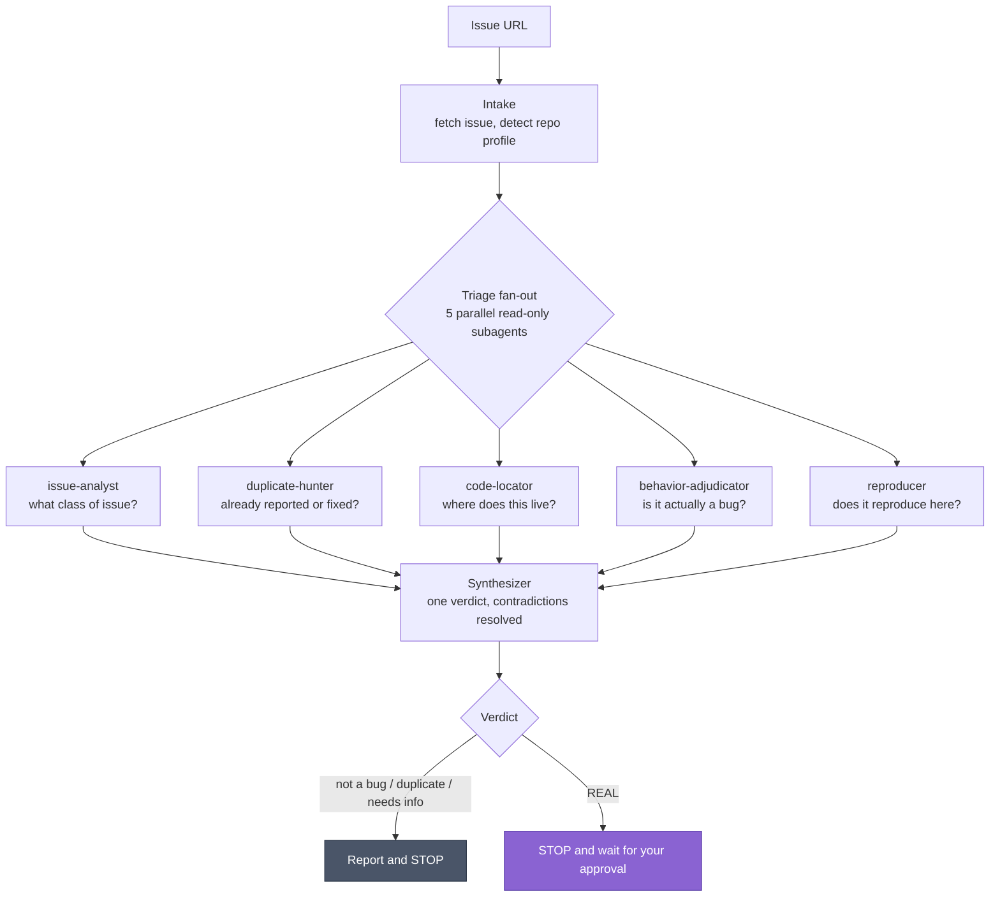
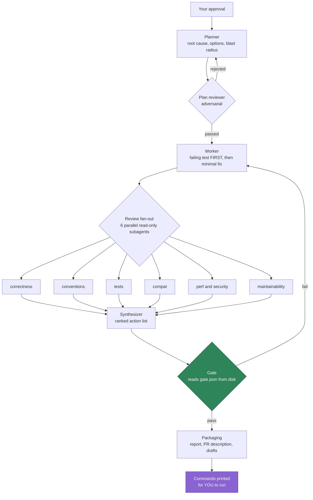
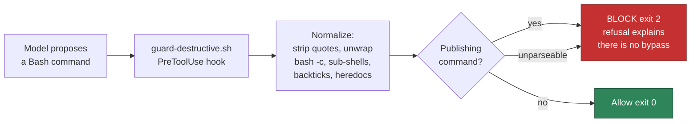
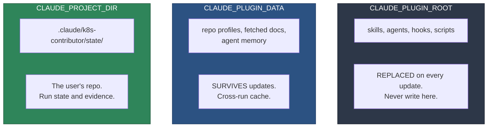

# Claude Code Plugin for Kubernetes

A production Claude Code plugin that triages, fixes, and verifies Kubernetes
issues using a graph of parallel subagents — and a complete, working reference
implementation of the Claude Code plugin format.

[](https://github.com/rithwik-01/claude-code-plugin-kubernetes/actions/workflows/validate.yml)
[](LICENSE)
[](https://code.claude.com/docs/en/plugins)
[](CONTRIBUTING.md)

**What it is.** A Claude Code plugin that takes a GitHub issue URL from
`kubernetes/kubernetes` or any `kubernetes-sigs/*` repository, investigates it
with five parallel read-only subagents, reaches a triage verdict, and — only
after you approve — plans a fix, writes the failing test first, implements the
change, reviews it with six more parallel subagents, and gates the result on
evidence files rather than on the model's own opinion. It never commits,
comments, or pushes on its own.

**Why it may be useful even if you do not work on Kubernetes.** This repository
is a full example of the Claude Code plugin format with every major component
wired together: 9 skills, 15 subagents, 5 hooks, a plugin manifest, userConfig
options, a self-hosted plugin marketplace, and CI that validates all of it. If
you are looking for a real Claude Code plugin to read rather than a
hello-world, start with [docs/architecture.md](docs/architecture.md) and
[plugins/k8s-contributor/](plugins/k8s-contributor/).

---

## Table of contents

- [Install](#install)
- [How it works](#how-it-works)
- [Commands](#commands)
- [The approval guarantee](#the-approval-guarantee)
- [Verification gates](#verification-gates)
- [Using this as a plugin template](#using-this-as-a-plugin-template)
- [Configuration](#configuration)
- [Token cost](#token-cost)
- [Limits](#limits)
- [FAQ](#faq)
- [Contributing](#contributing)

---

## Install

```bash
claude plugin marketplace add rithwik-01/claude-code-plugin-kubernetes
claude plugin install k8s-contributor@claude-code-plugin-kubernetes
claude plugin enable  k8s-contributor@claude-code-plugin-kubernetes
```

Then, inside Claude Code, from the directory that holds your cloned repos:

```
/k8s-setup
```

`/k8s-setup` finds your clones, checks your tooling, caches a build profile per
repository, resolves the Kubernetes contributor docs, and offers to install
recommended permission rules. It installs nothing without asking.

Requires **Claude Code v2.1.154 or later**. Developed and verified against
**v2.1.234** on macOS with bash 3.2.

### Other install methods

```bash
# Team or repo-scoped: records the choice in the project's .claude/settings.json
claude plugin install k8s-contributor@claude-code-plugin-kubernetes --scope project

# Local development on the plugin itself: no install, loads in place
claude --plugin-dir /path/to/claude-code-plugin-kubernetes/plugins/k8s-contributor
```

---

## How it works

You give it an issue URL. It fans out five read-only investigators in parallel,
merges their findings into one verdict, and **stops for your approval** before
touching any code.



Only after you approve, in words, does the fix pipeline run:



Both loops are bounded at three rounds. On exhaustion the run stops and writes
an escalation report naming exactly what is unresolved, rather than looping
forever or quietly lowering the bar.

Every build and test command is derived from a **profile auto-detected at
runtime** by reading the repository, so nothing is hard-coded to one project.
The same system derives `make test WHAT=... KUBE_RACE=-race` for
`kubernetes/kubernetes` and `go test -race -count=1 ./...` for `gwctl`.

---

## Commands

| Command | What it does |
|---|---|
| `/k8s-setup` | First run: find clones, check tooling, cache profiles, resolve docs, offer permission rules |
| `/k8s-triage <issue-url>` | Investigate in parallel, synthesize a verdict, stop for approval |
| `/k8s-fix <issue-url>` | Plan loop, failing-test-first implementation, six-way review, evidence gate |
| `/k8s-verify [state-dir]` | Run the applicable gates, read pass or fail off `gate.json` |
| `/k8s-report [state-dir]` | Package evidence into a report, a PR description, and drafts |
| `/k8s-profile <repo-dir>` | Detect and cache a repository's real build and test commands |

---

## The approval guarantee

> **This plugin never commits, never comments, and never pushes.**

Every such action is written to a file and printed for you to run yourself.

This matters more as a plugin than it does in a local config, because **a Claude
Code plugin cannot ship permission rules** — a plugin's `settings.json` honors
only `agent` and `subagentStatusLine`. So the guarantee rests on a `PreToolUse`
hook that ships with the plugin, is active the moment you enable it, requires
no configuration, and has no bypass.



It normalizes command text before matching, so nesting inside `bash -c`,
`$( )`, backticks, `xargs`, or a heredoc does not hide a payload, and it
**fails closed**: a command it cannot parse is blocked.

`/k8s-setup` additionally offers to merge a `permissions.deny` block into your
own settings, showing the exact diff first and writing only on explicit
confirmation. That block is defense in depth. Declining it leaves you fully
protected by the hook.

Verify it yourself against a scratch project with no permission rules at all:

```bash
bash scripts/prove-guardrails.sh
```

This runs in CI on every push. It proves that commits, pushes, PR creation,
issue comments, mutating API calls, and Prow slash-commands are all blocked —
including when hidden inside sub-shells or pipelines — while `git status`,
`git diff`, `git stash push`, `go test ./...`, and `gh issue view` still work.

---

## Verification gates

"Pass" is not "the tests are green". It is: *the specific defect described in
the issue is proven absent, by an artifact on disk, at the cheapest tier that
can prove it — and nothing else broke.*

| Gate | Name | Required |
|---|---|---|
| G0 | Build | always |
| G1 | Static and generated-code verify | always |
| **G2** | **Regression proof (red to green)** | always |
| G3 | Unit and race | always |
| G4 | Diff hygiene | always |
| G5 | Integration | cross-component semantics |
| G6 | Cluster and e2e | cluster-observable symptoms |
| G7 | Flake statistics | flaky tests, concurrency and timing |
| G8 | Benchmark | performance-sensitive paths |
| G9 | Docs and release note | user-facing change |
| G10 | CI parity | always (a checklist, never a local run) |

A gate that is skipped, missing, or marked pass with no evidence path forces an
overall failure. `run-gate.sh` refuses a non-run status without a stated
reason, and a gate deferred to CI must name the CI job that will cover it.

See [docs/verification-matrix.md](docs/verification-matrix.md) for which gates
apply to which change class, and [examples/sample-run/](examples/sample-run/)
for real artifacts from a real run — including an honest `overall: fail`
because four applicable gates were never recorded.

---

## Using this as a plugin template

If you are here to learn the plugin format rather than to work on Kubernetes,
these are the files worth reading, in order:

| File | What it demonstrates |
|---|---|
| [`plugins/k8s-contributor/.claude-plugin/plugin.json`](plugins/k8s-contributor/.claude-plugin/plugin.json) | Manifest with `userConfig`, `defaultEnabled`, keywords, JSON schema |
| [`.claude-plugin/marketplace.json`](.claude-plugin/marketplace.json) | A self-hosted marketplace catalog |
| [`plugins/k8s-contributor/hooks/hooks.json`](plugins/k8s-contributor/hooks/hooks.json) | `PreToolUse`, `PostToolUse`, and `SubagentStop` hooks using `${CLAUDE_PLUGIN_ROOT}` |
| [`plugins/k8s-contributor/agents/`](plugins/k8s-contributor/agents/) | 15 subagents: read-only tool restrictions, model selection, preloaded skills |
| [`plugins/k8s-contributor/skills/k8s-triage/SKILL.md`](plugins/k8s-contributor/skills/k8s-triage/SKILL.md) | A skill that fans out to parallel subagents, with `allowed-tools` scoping |
| [`plugins/k8s-contributor/scripts/lib/paths.sh`](plugins/k8s-contributor/scripts/lib/paths.sh) | The run-state vs cross-run-cache split, and why it matters |
| [`.github/workflows/validate.yml`](.github/workflows/validate.yml) | CI that validates the manifest, scripts, hooks, and guardrails |

The single most important thing to internalize is the path model:



---

## Configuration

Prompted when you enable the plugin. All optional.

| Option | Type | Purpose |
|---|---|---|
| `workspace_root` | directory | Parent directory holding your clones. Defaults to the current directory |
| `community_docs_path` | directory | Local `kubernetes/community` clone. Falls back to fetch and cache |
| `default_kind_cluster_name` | string | Cluster name prefix so concurrent runs do not collide. Default `k8s-fix` |
| `max_review_rounds` | number | Feedback-loop ceiling. Default `3`, minimum `1`, maximum `5` |
| `require_approval_before_commit` | boolean | Always on. There is no bypass; see below |

The `require_approval_before_commit` option exists only so this table can say:
setting it to `false` changes nothing. The hook still blocks, and its refusal
message says so explicitly.

---

## Token cost

`claude plugin details k8s-contributor` reports **approximately 2,839 tokens
always-on** once the plugin is enabled — the nine skill descriptions plus
fifteen agent descriptions, added to every session. On-invoke cost is roughly
1.5k to 3.6k per skill or agent, paid only when one actually fires. Hooks cost
**zero** model context, because they run in the harness rather than the model.

Because that always-on cost is not nothing, the plugin ships
`defaultEnabled: false`. Installing it does not switch it on. If you contribute
to Kubernetes regularly, enable it and pay the cost. If you use it
occasionally, enable it for a session and disable it afterwards.

---

## Limits

Stated up front, because finding these out mid-run is worse.

- **macOS cannot run node-e2e locally.** Those gates are recorded as deferred
  to CI, naming the presubmit that covers them. Never as pass.
- **kind node-image builds need roughly 6 GB of RAM and are slow** — tens of
  minutes for `kubernetes/kubernetes`. Note that `kind create cluster` on its
  own boots a *released* node image that does **not** contain your change,
  which is why building from source is the default.
- **`make verify` on `kubernetes/kubernetes` takes tens of minutes.** The
  detected profile records per-gate runtime estimates so you are warned before
  a long gate starts.
- **Nothing is cloned for you.** The plugin operates on clones already on disk.
- **The plugin never pushes**, so your git and GitHub credentials are never
  exercised by it.

---

## FAQ

### What is a Claude Code plugin?

A Claude Code plugin is a distributable bundle of skills, subagents, hooks, MCP
servers, and settings that extends Claude Code. It is defined by a
`plugin.json` manifest in a `.claude-plugin/` directory, and it is installed
either from a marketplace or from a local path. Unlike a project's `.claude/`
directory, a plugin is versioned, shareable, and copied into a cache directory
at install time.

### How do I install a Claude Code plugin?

Add the marketplace that hosts it, then install and enable the plugin:

```bash
claude plugin marketplace add <owner>/<repo>
claude plugin install <plugin-name>@<marketplace-name>
claude plugin enable  <plugin-name>@<marketplace-name>
```

### How do I create my own Claude Code plugin?

Create a directory containing `.claude-plugin/plugin.json` with at minimum a
`name` field, then add `skills/`, `agents/`, and `hooks/hooks.json` alongside
it — **not** inside `.claude-plugin/`, which holds only the manifest. Test it
without installing using `claude --plugin-dir /path/to/plugin`, and validate it
with `claude plugin validate /path/to/plugin --strict`. This repository is a
complete working example; see
[Using this as a plugin template](#using-this-as-a-plugin-template).

### Can a Claude Code plugin ship permission rules?

**No.** A plugin's `settings.json` honors only the `agent` and
`subagentStatusLine` keys. Every other key, including `permissions`, is
ignored. If you need to restrict what the model can do, you must implement it
as a `PreToolUse` hook, which plugins *can* ship. This repository does exactly
that; see [The approval guarantee](#the-approval-guarantee).

### What frontmatter fields can plugin subagents use?

Supported: `name`, `description`, `model`, `effort`, `maxTurns`, `tools`,
`disallowedTools`, `skills`, `memory`, `background`, and `isolation`.

Explicitly **not** supported for plugin-shipped agents, for security reasons:
`hooks`, `mcpServers`, and `permissionMode`. These are silently ignored. If an
agent needs a hook, put it in the plugin-level `hooks/hooks.json` with a
`SubagentStart` or `SubagentStop` matcher on the agent name instead.

### How do I run multiple Claude Code subagents in parallel?

Launch them in a single message. A skill that delegates to several subagents at
once will run them concurrently. This repository fans out five investigators
during triage and six reviewers during review; see
[`skills/k8s-triage/SKILL.md`](plugins/k8s-contributor/skills/k8s-triage/SKILL.md).
Keep read-heavy work in ephemeral subagents so their output stays out of the
main conversation's context.

### Where should a Claude Code plugin write files?

Three locations, with three different lifetimes:

- `${CLAUDE_PLUGIN_ROOT}` is the plugin's own installed directory. It is
  **replaced on every update**, so never write anything here.
- `${CLAUDE_PLUGIN_DATA}` **survives updates**. Use it for caches, downloaded
  assets, and anything that would be expensive to regenerate.
- `${CLAUDE_PROJECT_DIR}` is the user's project. Use it for per-project state
  that belongs next to their code and can be gitignored.

Relative paths that escape the plugin root do not resolve, because the plugin
is copied into a cache directory at install time.

### How do I stop Claude Code from committing or pushing?

Two mechanisms, and they are not equivalent. `permissions.deny` rules in
`settings.json` are simple and readable, but they cannot travel with a plugin
and they do not see inside `bash -c "..."`, sub-shells, or a script the model
just wrote. A `PreToolUse` hook can normalize the command text first and catch
those nested forms, and it *can* be shipped in a plugin. For a hard guarantee,
use a hook and treat deny rules as defense in depth. See
[`guard-destructive.sh`](plugins/k8s-contributor/hooks/scripts/guard-destructive.sh)
for a complete implementation, and `scripts/prove-guardrails.sh` for its tests.

### How do I publish a Claude Code plugin marketplace?

Put a `marketplace.json` in a `.claude-plugin/` directory at your repository
root, listing each plugin with a `name` and a `source`. Push it to GitHub. Users
run `claude plugin marketplace add <owner>/<repo>`. See
[`.claude-plugin/marketplace.json`](.claude-plugin/marketplace.json).

### Why do users not receive my plugin updates?

Because `version` in `plugin.json` did not change. Users are pinned to the
version string and receive nothing — not even a bug fix — until it is bumped.
Bumping it is part of every release, alongside the matching bump in
`marketplace.json`. This repository's CI fails the build if the two disagree.

### Does this plugin work on repositories other than Kubernetes?

It is built for `kubernetes/*` and `kubernetes-sigs/*` repositories, and the
contributor conventions it enforces are Kubernetes-specific. However, nothing
in the architecture is: the build and test commands come from a profile
detected at runtime, so the profile detector, the gate runner, and the
guardrail hooks would transfer to any Go project with modest changes.

### Does this plugin send my code anywhere?

No. Everything runs locally. The only network access is `gh` calls to read the
GitHub issue you point it at, and a one-time sparse fetch of the public
`kubernetes/community` documentation repository if you do not already have a
local clone.

---

## Documentation

- [Quickstart](docs/quickstart.md) — install, prerequisites, and a normal run
- [Architecture](docs/architecture.md) — the agent graph, residency, and state model
- [Verification matrix](docs/verification-matrix.md) — the gates and what "pass" means
- [Adding a reviewer](docs/adding-a-reviewer.md) — extending the review fan-out
- [Sample run](examples/sample-run/) — real artifacts from a real run
- [Changelog](plugins/k8s-contributor/CHANGELOG.md)

---

## Contributing

Contributions are welcome, including first-time ones. Documentation fixes,
bug reports, additional repository profiles, and new reviewer agents are all
useful, and you do not need to be a Kubernetes maintainer to help.

Start with [CONTRIBUTING.md](CONTRIBUTING.md). It covers a two-minute local
setup, the three checks to run before opening a pull request, and the rules
that matter — chiefly that the approval guarantee must never be weakened.

If you find a way to get a publishing command past the guardrail hook, please
open an issue with the exact command. That is treated as a priority.

## License

[Apache-2.0](LICENSE), matching the Kubernetes ecosystem norm.
